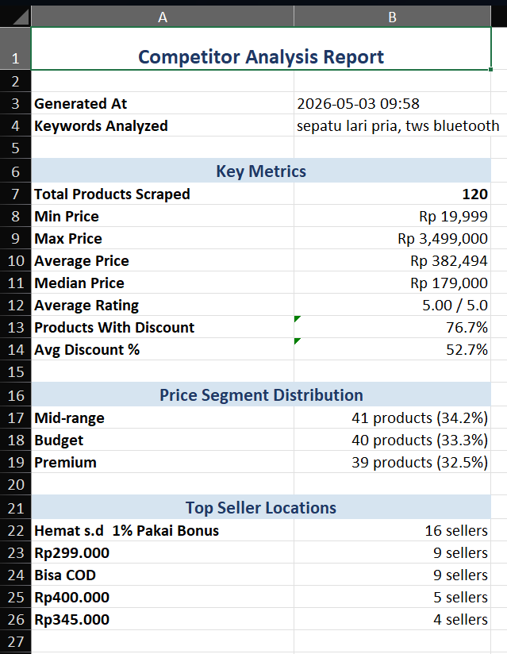
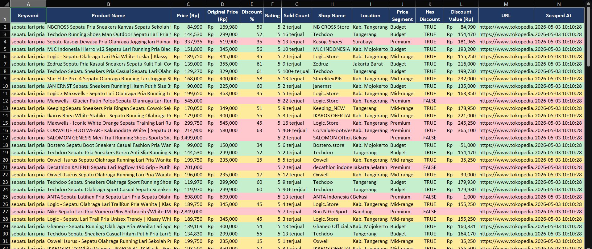
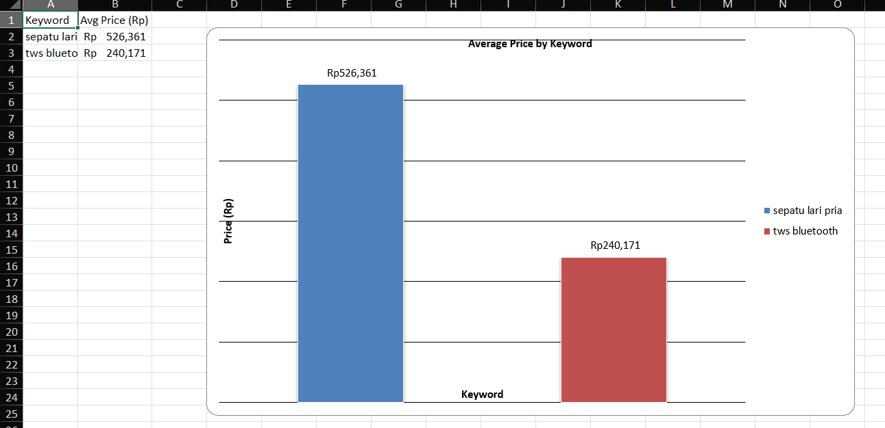

# Tokopedia Competitor Scraper

> 🇮🇩 [Baca dalam Bahasa Indonesia](#bahasa-indonesia) | 🇬🇧 [Read in English](#english)

---

## English

### Overview
A Python-based tool to scrape product listings from Tokopedia based on keywords, analyze pricing data, and generate a formatted Excel report with charts and segment breakdowns.

### Output Preview

1. Summary Sheet


2. Product Data Sheet


3. Price Chart


### Features
- Scrapes product data from Tokopedia search results
- Supports multiple keywords in a single run
- Cleans and analyzes data (price segmentation, discount detection)
- Generates a styled `.xlsx` report with summary, data sheet, and price chart

### Project Structure
```
tokopedia-competitor-scraper/
├── main.py          # Entry point
├── scraper.py       # Selenium-based web scraper
├── cleaner.py       # Data cleaning and analysis
├── reporter.py      # Excel report generator
├── requirements.txt
├── .gitignore
└── README.md
```

### Requirements
- Python 3.10+
- Google Chrome (installed on your machine)

### Installation

1. Clone the repository
```bash
git clone https://github.com/your-username/tokopedia-competitor-scraper.git
cd tokopedia-competitor-scraper
```

2. Create and activate virtual environment
```bash
python -m venv .venv

# Windows
.venv\Scripts\activate

# Mac/Linux
source .venv/bin/activate
```

3. Install dependencies
```bash
pip install -r requirements.txt
```

### Configuration
This project uses a config.json file to manage keywords and settings.
A config.example.json template is provided. Copy and rename it before running the program.

```bash
cp config.example.json config.json
```

Then open config.json and adjust the values as needed.
Note: config.json is excluded from version control to keep your keywords private.

### Usage

```bash
python main.py
```

The report will be saved in the `output/` folder as an `.xlsx` file with a timestamp in the filename.

### Output
- `output/competitor_report_YYYYMMDD_HHMMSS.xlsx` — Excel report
- `analyzer.log` — Log file

---

## Bahasa Indonesia

### Gambaran Umum
Tool berbasis Python untuk melakukan scraping listing produk dari Tokopedia berdasarkan kata kunci, menganalisis data harga, dan menghasilkan laporan Excel terformat lengkap dengan grafik dan segmentasi harga.

### Pratinjau Laporan

1. Sheet Rangkuman


2. Sheet Data Produk


3. Grafik Harga


### Fitur
- Scraping data produk dari hasil pencarian Tokopedia
- Mendukung beberapa kata kunci dalam satu kali jalankan
- Membersihkan dan menganalisis data (segmentasi harga, deteksi diskon)
- Menghasilkan laporan `.xlsx` dengan tampilan rapi: ringkasan, tabel data, dan grafik harga

### Struktur Project
```
tokopedia-competitor-scraper/
├── main.py          # Titik masuk program
├── scraper.py       # Web scraper berbasis Selenium
├── cleaner.py       # Pembersihan dan analisis data
├── reporter.py      # Generator laporan Excel
├── requirements.txt
├── .gitignore
└── README.md
```

### Persyaratan
- Python 3.10+
- Google Chrome (terinstall di komputer)

### Instalasi

1. Clone repository
```bash
git clone https://github.com/your-username/tokopedia-competitor-scraper.git
cd tokopedia-competitor-scraper
```

2. Buat dan aktifkan virtual environment
```bash
python -m venv .venv

# Windows
.venv\Scripts\activate

# Mac/Linux
source .venv/bin/activate
```

3. Install dependensi
```bash
pip install -r requirements.txt
```

### Konfigurasi

Project ini menggunakan file config.json untuk mengatur kata kunci dan pengaturan lainnya.
Template config.example.json sudah disediakan. Salin dan ubah namanya sebelum menjalankan program.

```bash
cp config.example.json config.json
```

Kemudian buka config.json dan sesuaikan nilainya sesuai kebutuhan.
Catatan: config.json tidak ikut tersimpan di repository agar kata kunci pencarian kamu tetap bersifat pribadi.

### Cara Penggunaan

```bash
python main.py
```

Laporan akan tersimpan di folder `output/` dalam format `.xlsx` dengan timestamp di nama filenya.

### Output
- `output/competitor_report_YYYYMMDD_HHMMSS.xlsx` — Laporan Excel
- `analyzer.log` — File log

---

> ⚠️ **Disclaimer / Peringatan**  
> This tool is intended for educational and personal research purposes only. Use responsibly and in accordance with Tokopedia's Terms of Service.  
> Tool ini dibuat untuk keperluan edukasi dan riset pribadi. Gunakan secara bertanggung jawab sesuai dengan Syarat & Ketentuan Tokopedia.
